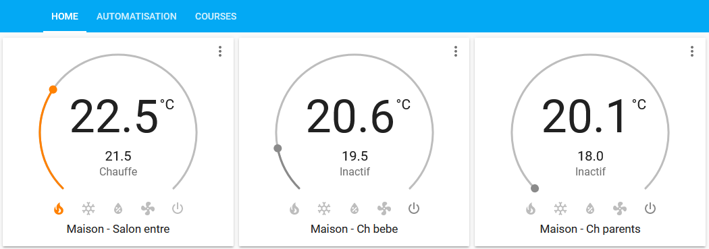

# Airzone Cloud plugin for Home Assistant

## Introduction

Allow to view & control all your zones register on your Airzone Cloud account from [Home Assistant](https://www.home-assistant.io/).



## Install / upgrade

### Add module

In your home assistant directory (where you have your **configuration.yaml**) :

* create the directory **custom_components** if not already existing
* copy **airzonecloud** directory from this github repository inside **custom_components**. In case of upgrade, you can delete the **airzonecloud** first then copy the new one.

Finally, you should have the following tree :

* configuration.yaml
* custom_components/
  * airzonecloud/
    * \_\_init__.py
    * climate.py
    * const.py
    * manifest.py

### Configure

In your **configuration.yaml** add the following lines :

```
climate:
  - platform: airzonecloud
    username: your@mail.com
    password: yourpassword
```

You're username & password should match what you use to connect to https://www.airzonecloud.com

#### Specific API

If you use are rebranded Airzone, you should change the API (default to https://www.airzonecloud.com).

Here an example for Daikin rebranded Airzone :

```
climate:
  - platform: airzonecloud
    username: your@mail.com
    password: yourpassword
    url_api: https://dkn.airzonecloud.com
```

#### Change refresh interval

Default refresh interval is **10 seconds**.

You can increase or decrease this value but be warned that you can be banned by Airzone if you refresh too often.

```
climate:
  - platform: airzonecloud
    username: your@mail.com
    password: yourpassword
    scan_interval: 5
```